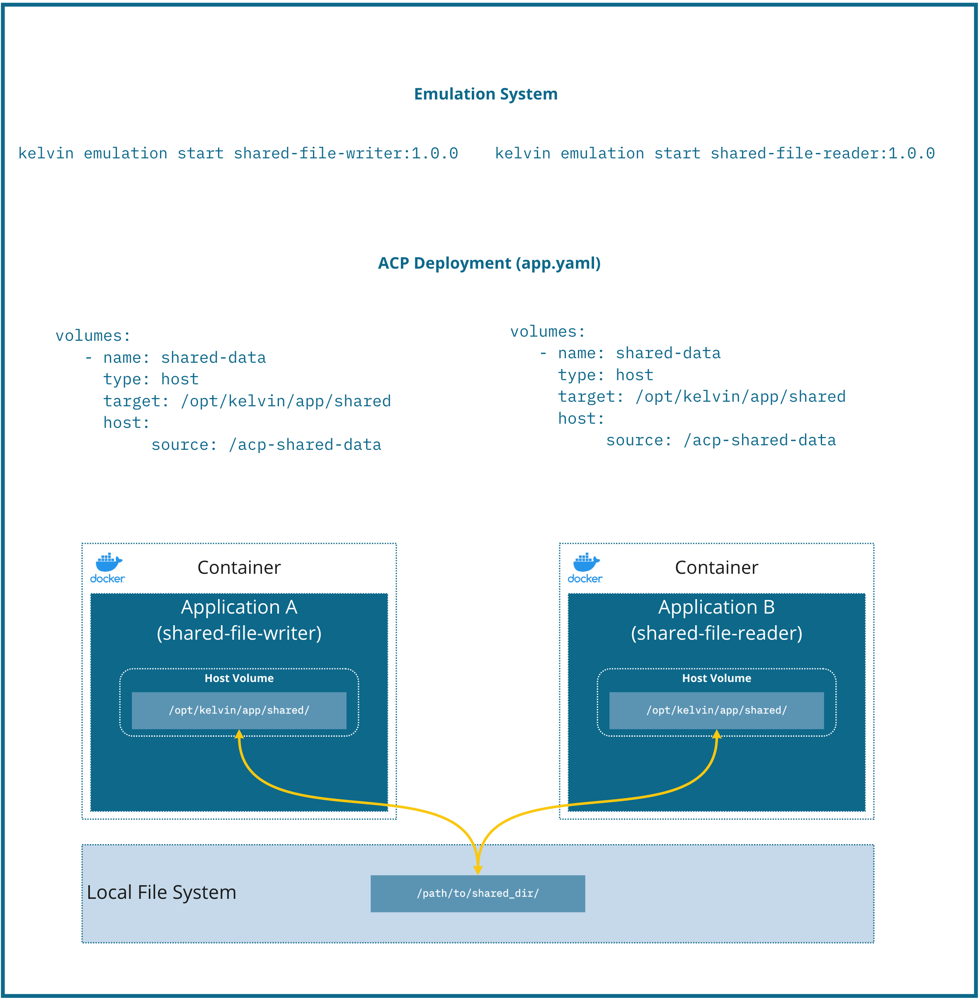

# Shared file reader and writer

Similar to the ACP data sharing example, this project shows how to share data between two applications, 
in the **emulation system**, using a **shared volume**


## Initial assumptions

1 - Applications built using the **kelvin** tool will be hosted, inside the container, under **/opt/kelvin/app**.

2 - In the emulation system, volumes defined in the **app.yaml** are exposed similarly to the node deployment.

## Structure


## Example description

This is a simple example that shows two different workloads sharing the same host path/file.

`shared-file-writer` Writes a random integer value in each second to the shared file.   
(Writing to **/tmp/data/buffer_log.log**, i.e, **/opt/kelvin/app/data/buffer_log.log**)

`shared-file-reader` project reads the shared file for each second and prints the last line.  
(Reading from **/tmp/data/buffer_log.log**, i.e, **/opt/kelvin/app/data/buffer_log.log**)

**Note: The shared file lives in the host environment.**

## Command guide

Assuming both applications are under the same directory **shared-file-emulation**, position the console on that
directory:

* 1 - Build both applications with:
    * 1.1 `kelvin app build --app-dir=/path/to/kics-app-examples/shared-file-emulation/shared-file-writer`
    * 1.2 `kelvin app build --app-dir=/path/to/kics-app-examples/shared-file-emulation/shared-file-reader`
* 2 - Run both applications and provide a directory to be **shared** between them. (If it does not exist, it will be
  created)
    * 2.1 Confirm both applications are built and ready to be emulated. `kelvin app images list` should yield
      both `shared-file-writer` and `shared-file-reader` under `Existing Apps`
    * 2.2 `kelvin emulation start shared-file-writer:1.0.0`
        ```
        ➜ kelvin emulation start shared-file-writer:1.0.0 --app-config=app.yaml --show-logs                                                                                                                                                         
        [kelvin.sdk][2021-03-08 11:00:20][I] Initializing the emulation system.                                                                                                                                                                                   
        [kelvin.sdk][2021-03-08 11:00:20][I] Emulation system is running.                                                                                                                                                                                         
        [kelvin.sdk][2021-03-08 11:00:20][I] Loading configuration and starting the application                                                                                                                                                                   
        [kelvin.sdk][2021-03-08 11:00:20][I] Starting application "shared-file-writer:1.0.0"                                                                                                                                                                      
        [kelvin.sdk][2021-03-08 11:00:20][R]                                                                                                                                                                                                                          
            Emulation configurations applied to container:                                                                                                                                                                                                                                   
                └── Volumes:                                                                                                                                                                                                                                                                 
                   - "/opt/kelvin/app/data" connected to "/tmp/data" (container -> host)                                                                                                                                                                                                     
                └── Memory:                                                                                                                                                                                                                                                                  
                   - Container memory restricted to a maximum of "256M"                                                                                                                                                                                                                                   
        [kelvin.sdk][2021-03-08 11:00:20][I] Stopping containers of "shared-file-writer:1.0.0"                                                                                                                                                                    
        [kelvin.sdk][2021-03-08 11:00:31][I] Containers of "shared-file-writer:1.0.0" successfully stopped             
        [kelvin.sdk][2021-03-08 11:02:13][R] Applications successfully launched: "shared-file-writer:1.0.0"   
        ```      
    * 2.3 `kelvin emulation start shared-file-reader:1.0.0`
        ```
         ➜ kelvin emulation start shared-file-reader:1.0.0 --app-config=app.yaml --show-logs                                                                                                                                                                                                                                
        [kelvin.sdk][2021-03-08 11:02:13][I] Initializing the emulation system.                                                                                                                                                                                                                                                 
        [kelvin.sdk][2021-03-08 11:02:13][I] Emulation system is running.                                                                                                                                                                                                                                                       
        [kelvin.sdk][2021-03-08 11:02:13][I] Loading configuration and starting the application                                                                                                                                                                                                                                 
        [kelvin.sdk][2021-03-08 11:02:13][I] Starting application "shared-file-reader:1.0.0"                                                                                                                                       
        [kelvin.sdk][2021-03-08 19:23:49][R]                                                                                                                                                                                                                                                 
            Emulation configurations applied to container:                                                                                                                                                                                                                                   
                └── Volumes:                                                                                                                                                                                                                                                                 
                   - "/opt/kelvin/app/data" connected to "/tmp/data" (container -> host)                                                                                                                                                                                                     
                └── Memory:                                                                                                                                                                                                                                                                  
                   - Container memory restricted to a maximum of "256M"                                                                                                                                                                                                                                                                                                    
        [kelvin.sdk][2021-03-08 11:02:13][I] Stopping containers of "shared-file-reader:1.0.0"                                                                                                                                                                                                                                  
        [kelvin.sdk][2021-03-08 11:02:13][I] Containers of "shared-file-reader:1.0.0" successfully stopped              
        [kelvin.sdk][2021-03-08 11:02:13][R] Applications successfully launched: "shared-file-reader:1.0.0"              
        ```
* 3 - Confirm both applications are, respectively, writing and reading data with:
    * 4.1 `kelvin emulation logs shared-file-writer:1.0.0`
        ```
        ➜ kelvin emulation logs shared-file-writer:1.0.0
        ...                                                                                                                                                                            
        Writing to shared file the following value: 3308      
        Writing to shared file the following value: 3308                                                                                                                                                                                                          
        Writing to shared file the following value: 2961                                                                                                                                                                                                          
        Writing to shared file the following value: 4389                                                                                                                                                                                                          
        Writing to shared file the following value: 4925                                                                                                                                                                                                          
        Writing to shared file the following value: 607                                                                                                                                                                                                           
        Writing to shared file the following value: 547                                                                                                                                                                                                           
        Writing to shared file the following value: 1401      
        ```
    * 4.2 `kelvin emulation logs shared-file-reader:1.0.0`
        ```
        ➜ kelvin emulation logs shared-file-reader:1.0.0
        ...                                                                                                                                                                                                                                                                                   
        The last line read from the shared file: 1265                                                                                                                                                                                                                                                                           
        The last line read from the shared file: 1206                                                                                                                                                                                                                                                                           
        The last line read from the shared file: 1348                                                                                                                                                                                                                                                                           
        The last line read from the shared file: 3625                                                                                                                                                                                                                                                                           
        The last line read from the shared file: 4767                                                                                                                                                                                                                                                                           
        The last line read from the shared file: 3194   
        ```
