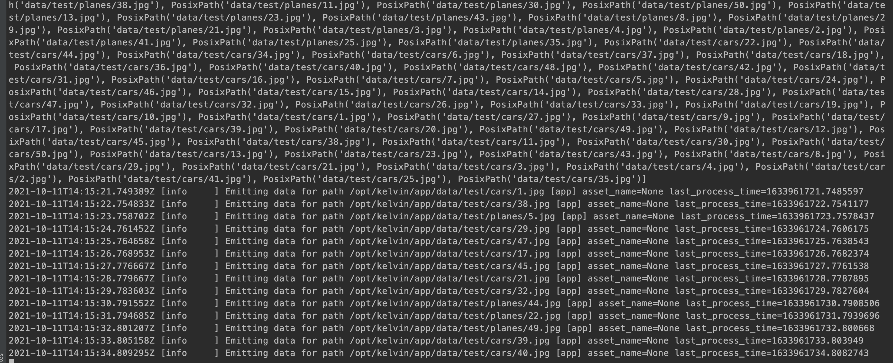

# Vehicle Image Detection

This example illustrates a simple image detection application and how it can be implemented using Kelvin's tech stack.


# Pre-requisites

* The latest version of KSOS installed.
* A clean, isolated python virtual environment.


# The structure

### 1. Vehicle Model Trainer #

Start off by building the trained model using the `vehicle-model-trainer`.  
The build process will point to the `app.yaml` file. In this file, a system volume has been defined to output the contents of trained model into the host machine.  
The code under `trainer.py` will be executed and a new `trained_model.h5` file will be generated.

1. Under `vehicle-model-trainer/` run `kelvin app build --verbose`
2. Copy the generated `trained_model/model_saved.h5` file to a safe directory for later usage.


### 2. Vehicle Image Publisher #

The second application, the `vehicle-image-publisher`, will be tasked with publishing use-case images.  
Images inside `vehicle-image-publisher/data` will be randomly selected and published to the broker.  
Code under `vehicle_image_publisher/vehicle_image_publisher.py` will be responsible for handling the data.  

Inside the `app.yaml`, it is important to note the output configuration channels where data will be published:
```
    outputs:
      - name: vehicle_image
        data_type: object
        targets:
          - workload_names: [ "vehicle-image-publisher" ]
            asset_names: [ "emulation" ]
```

1. Under `vehicle-image-publisher/` run `kelvin app build --verbose`  
2.  Run `kelvin emulation start --show-logs`




### 3. Vehicle Image Detector #

The third and last application, the `vehicle-image-detector`, will be fed images and will have to 'guess' its content.
Code under `vehicle_image_detector/vehicle_image_detector.py` will be responsible for handling the data.  

Inside the `app.yaml`, it is important to note the input configuration channels from where data will be consumed:
```
    inputs:
      - name: vehicle_image
        data_type: object
        sources:
          - workload_names: [ vehicle-image-publisher ]
            asset_names: [ emulation ]
```

Note the inputs match the output specifications of the producer application. This will tie both applications and communication will be established. 

1. Copy the `model_saved.h5` file generated by the first application and past it on the `data` directory of this application.
2. Under `vehicle-image-publisher`/ run `kelvin app build --verbose`
3. Run `kelvin emulation start --show-logs`


